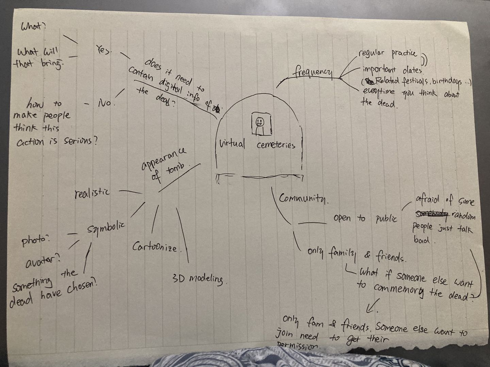
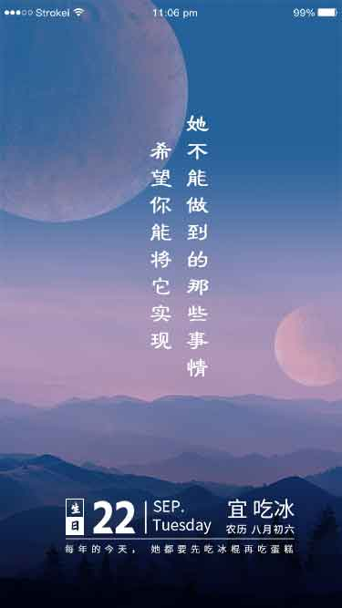
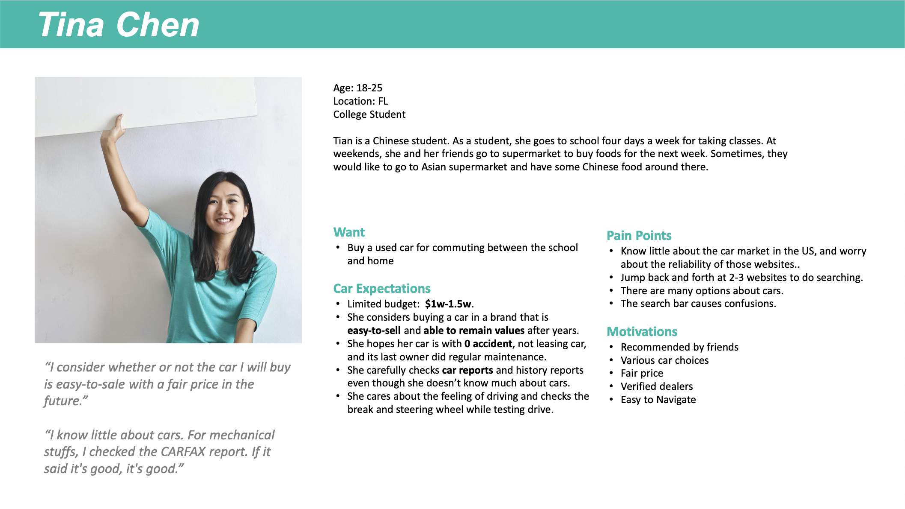
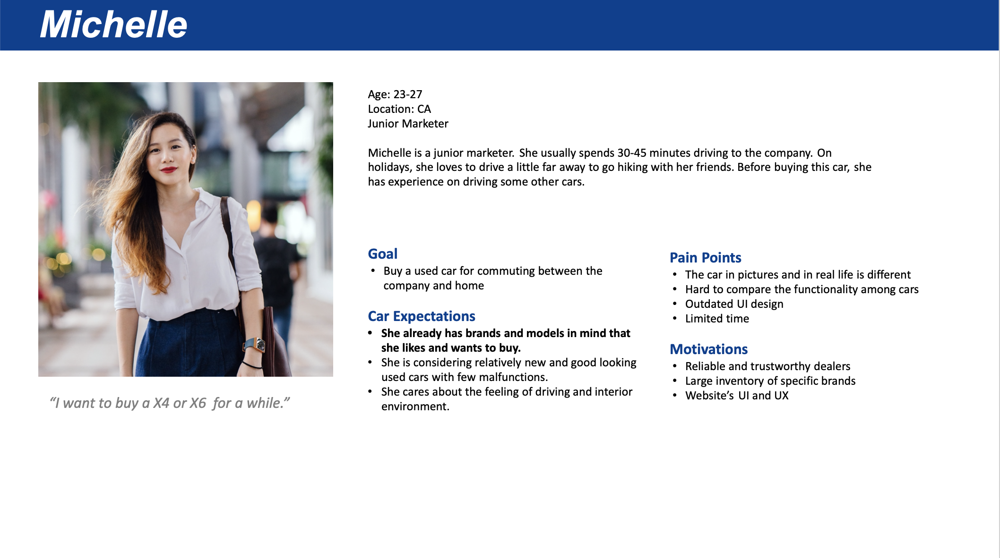
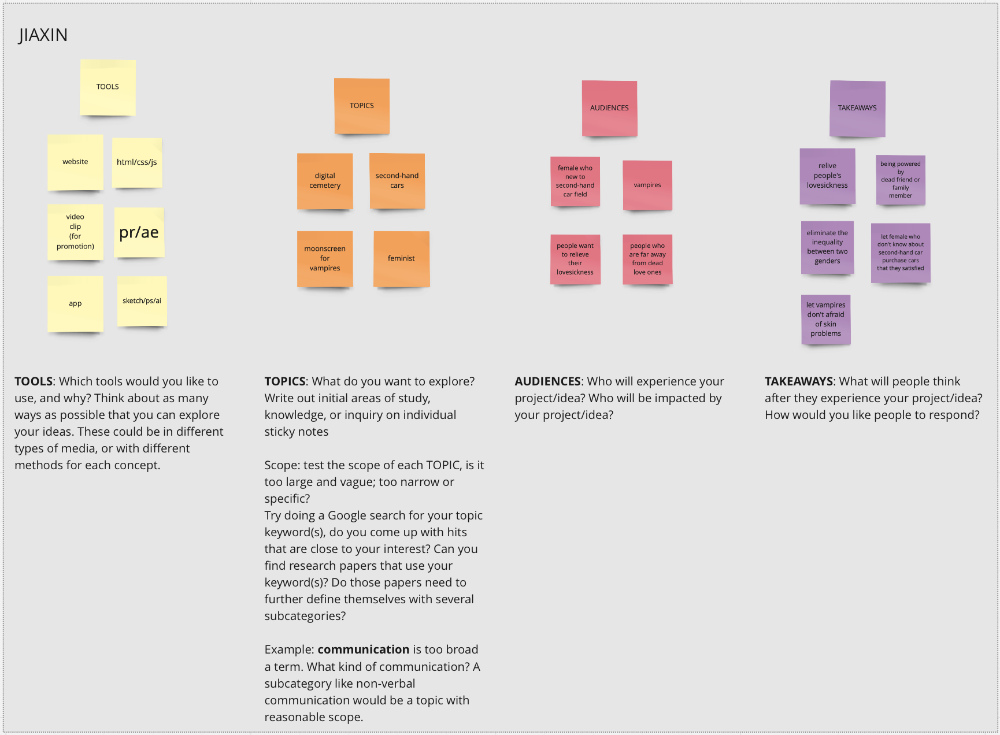
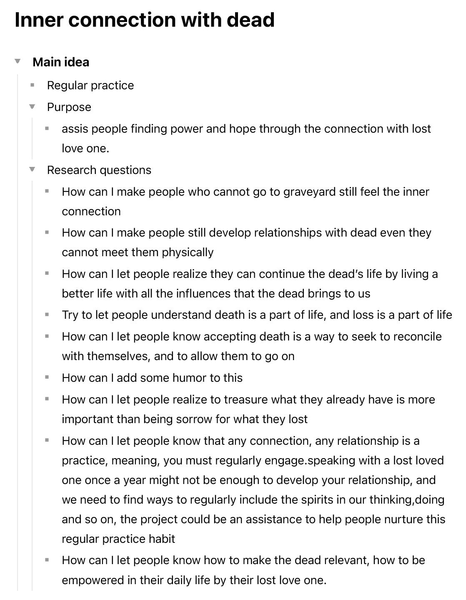

# Audience

- Who is my audience? What knowledge about the subject does my audience already have?

    people who have lost their loved one(s). 

- What does my audience think, believe, or understand about this topic before they encounter my work?

     Before they encounter my work, they may feel the pain and hesitation of losing loved one. Although they work/study/life ordinaryly, when they think of the one passed by, they feel regret and uneasiness. When sometime they need help or need to make an important decision, they feel lost, unsupported and unrooted. 

- What do I want my audience to think, believe, or understand about this topic after they encounter my work?

     I want my audience feel relieved, supported, inspiraring and safe even after they lose their important one. They can get a some kind of power from the dead through my work to make their life better, feeling more controlled, feeling they are the protagonist of their life.

- How do I want my audience to think of me? What role do I want to play in addressing my audience?

# Context & Research

What I want to know most right this stage of research is:" If people have to choose, what is the only thing they will do to mourn their ancestor or dead loved ones?" I have this question because I want my product can be about something that people shares, instead of only limited to a group of people. I only talked about this project with a few people and those perspectives are far less than what I should have for making what I want.

I am planning to do a questionnaire, ask about some questions about mourning. However, specific questions are not clear yet. What for sure is the question mentioned above will be included. 

Also, interviewing sounds quite efficient for my case. I am thinking of interviewing people from a physical graveyard, someone who don't want to attend any virtual mourning related stuff, someone who considered their own death, etc. 

I want to answer one of my design questions, which is "How can I help people, relieve their lovesickness and bring them power?" I tried to make a daily memo for mourning, but I don't know are they effective or not.

# Setting Goals (temporary)

- Think of one possibility each week that might become one of functions of my final product

- Go through at least two leassons of the online UI course each week in September 28 - October 28, and try to 
combine what I have learned into small visual prototypes each week according to the last goal. I will update this goal after a while, depending on how much I leanrned.

- Try to make a web version of things I have done in the first and second goal every week after October 28. Using the JS course knowledge that I will take as much as possible. 

### What needs get done this week for thesis:

1/ think of one possibility of my topic

2/ go through 2 online UI lessons

3/ design an visual prototype for this possibility

# Mindmap 

Here is a mindmap representing my core area of interest (virtual cemetries) and its subset topics. 

# Update

I tend to choose the virtual graveyard topic as my thesis topic. I can feel the inner connection between me and this topic is stronger than any others. 

### new prototype

Prototypes help to explore and make tangible ideas or concepts.

Prototypes help to share the idea and make it accessible to others.

The key is let users have solemn communication with their ancestors. A period of time and/or space to feel their own emotions for this ancestor.

I want this process could be not that serious but effortless and enjoyable. 

For this prototype, I decide to use “Ri Qian” as the format. It seems not such a thing in Western culture, but I am not sure. It’s basically a daily calendar shows you the date, festivals, and always a quote. I found a sample and post here.

By browsing the dead’s digital information, conclude some regular pattern to use here

The little action for users to do to get the feeling of inner connection with the dead 

### motivation 

I am studying how to build a digital cemetery because I want to find out how could a digital solemn cemetery be an alternative way of a real one. 

In order to help people, relieve their lovesickness and bring them power. 

in order to understand  what can loved one's leave brings to people. If the thing is not positive, how can I turn it into positive power to help people live better, feel more sense of control.

My goal is to make  an app & web  so that people can have a new lifestyle  which helpful to them. 

# Initial Literature Review 

This is the first week of Thesis studio. Before first online class begin, I rethink what happened in my life recently and tried to find out some good ideas for Thesis Studio to explore. 

After brainstorm and organize, I got three ideas:

### 1/3

  An online service of everything about sencond-hand car which designed especially for women. 
     I found the first question as a feminist. One day when I want to buy a second-hand car and viewed several websites, I found it almost an impossible task for me to make a decision for several reasons (pain point for users as well):
     
-   afraid of being dumped 
-   afraid of buying a car with hidden fault, need to fix them very often
-   lots of information about insurance, auto repair， car care and so on…  that’s could be overwhelming for somebody new to the field
-  Lots of car brands， public opinions are divergent， no unified and directive one.  might be confusing.
- For someone don’t know car at all, there’s no any websites or other info source stands in their point of view and to answer some possible questions. Like “what protection could this particular type of car give you when you are being hit by another car”
- All websites I have viewed use terminologies, like hatchback, lift-back and so on. these words are rarely being used in daily lives and hard to remember. That’s actually set a high threshold for users.
So, the practical problem of the first one could be: 
•	Condition: There is no second-hand car exchange website for women who are new to this field
•	Cost: Women new to second-hand car field hard to find car that they are satisfied

The research problem will be:
I am studying how to design a second- hand car trade website especially for women who don’t familiar with this market. Because I want to find how to help this type of people to get cars that they are satisfied without being teased or overwhelmed. In order to help everyone could buy cars in a fair condition. And that might be helpful to eliminate the inequality between people.

### 2/3

2. A virtual cemetery, that could help people could not memorial their dead loved ones because of multiple reasons (for example, long distance or time conflict and so on...)to relieve their lovesickness.

As an international student, every time when Qingming festival comes (a festival for people to offer libation for dead relatives), I cannot visit the graves and sweep the tomb for my grandma because of distance, which made me feel sad. So, I am thinking, today digital life already a part of us, why don’t we introduce death into digital world as well? 

I am thinking of making a digital Cemetery, where people could sweep tomb, leave message and so on. 

The practical problem for the second idea would be:

•	Condition: many people miss their dead family members or friends but cannot memorial them because of distance

•	Cost: people cannot feel the warm brings by visiting loved one’s tomb, and solve the lovesickness 

The research problem would be:
I am studying how to build a digital cemetery. Because I want to find could a digital solemn cemetery be an alternative way of a real one. In order to help people, relieve their lovesickness and bring them power. What’s more is I want to see that could this be a new lifestyle for people in the future.

#### Prototype

Because what I intend to do with this one is a website with/or an mobile app. So I interviewed some friends and made two persona which represent my target audience.

### 3/3

3. A moonscreen for Vampires. Because moonlight is comes from sunlight, so I think moonlights should be harmful for vampires to some extent, they just not as lethal as sunlights for vampires. So I am thinking of doing this moonscreen product for Vampires. However, I know it's not a good topic for Thesis. I will save this one for future. 

### Mindmap

# Main Idea

Along with the digging in to the topic, I have determined some main idea that my project must follow, here attached is the list. (there are lots research questions, I wish my project can fulfill them as many as possible in the addition of achieve the purpose.)

# Midterm Reflection

Strength:
I think my project idea is not bad. 

Weaknesses:
Speaking not fluent enough (lots of “and” “emmm”in the presentation. I didn’t realize it until I review the recording).
Always doubting myself.

Could improve: 
Bolden some keywords, let viewers get the gist easier.

self-assessment grade:
Concepting:3, research:2, Prototyping: 3

