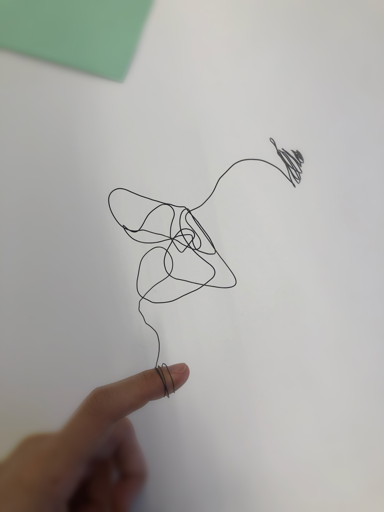
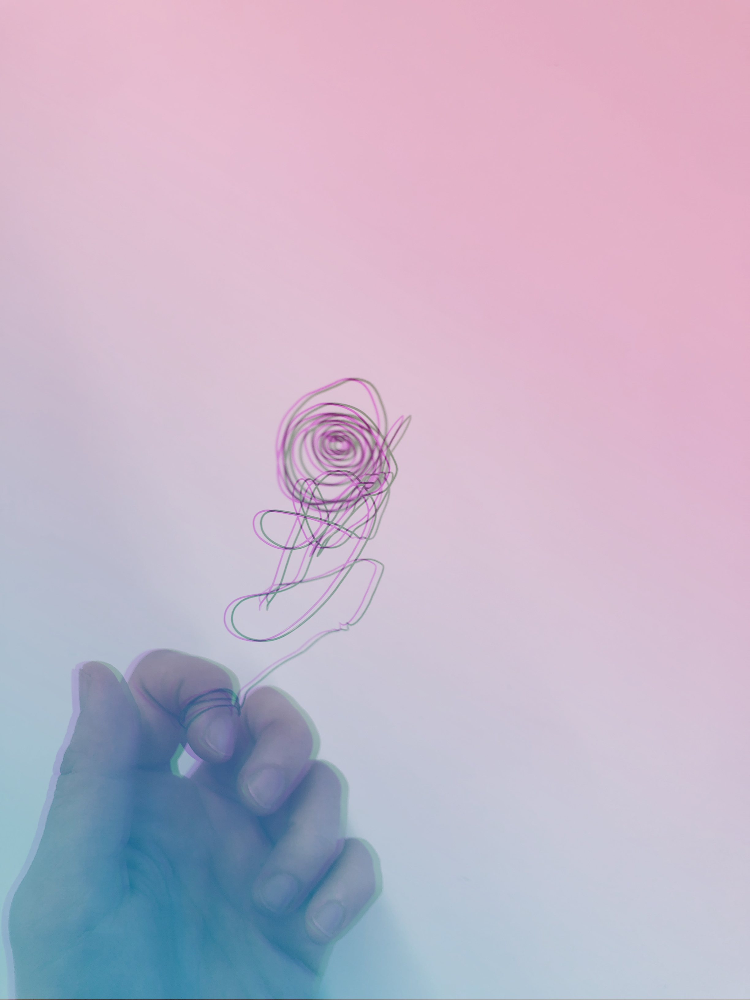
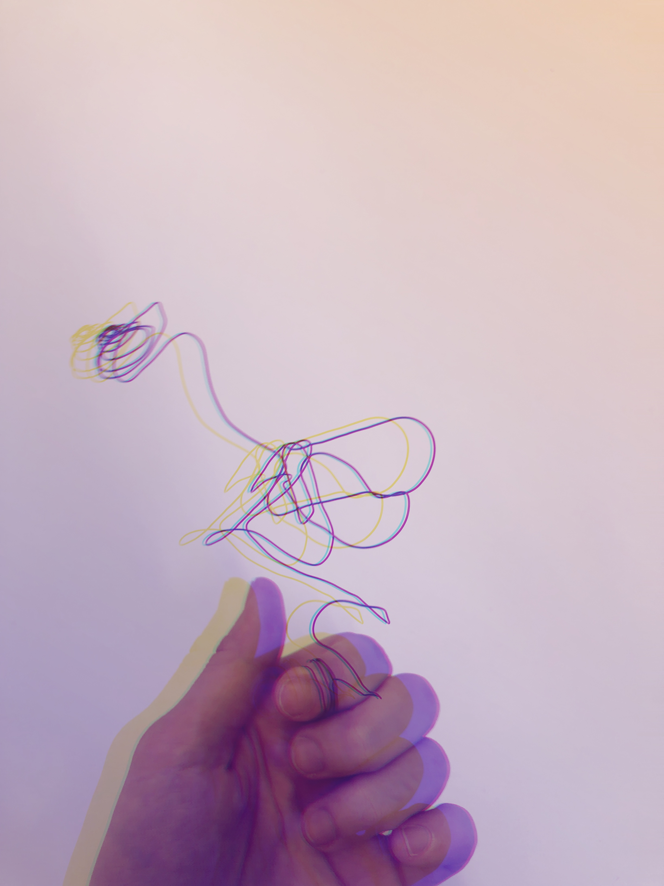

# Augmentation

* What is augmentation? and what kind of impact it brings to our life or even our future? what "augment" means in the human experience? I am going to do one semester-long project to explore it.I will work out various definitions and elaborate on this prompt.*

** My intrepretation towards Augmentation **

When I think about "Augmentation", the first thing comes into my mind is education. Education is a process that brings people from apes to new-era human beings; from innocent babies to versatiled adults. Education is undoubtedly an important determinator to a person's life and future. 

By using this sculture, I expressed the interpretation of the relationship of education and augmentation in my own perspective.

This is a wearable sculture, you can easily fit it in any of your fingers and it's convenient to adjust the size. The whole sculpture represents education. It can be divided into three parts: the first part is the connection part with fingers. The right to chose being educated or not, which field to study, what diploma to get is always hold in your hand. The second part is in the middle. It looks quite messy and clueless, exactly looks like what we learn in primary educations --- we learn a lot of stuff a little bit from almost all study fields. The third and last part is the spiral part. It represents our higher educations. in this period, we find out one thing that we love to explore and keep learning in that field. There is a word in Chinese "钻研", which means "dig in" in a specific study field. I think if there is any chance to visualize this word, what it looks like must be the third part of my sculpture. 

Also, As you can easily move your finger to make the 
