# Final project 

I am someone who can always generate random ideas in anytime. There was one time, when I taking class, I begin to think about a friend of mine. He is a medical student,he sheared me a lot of stories about what he has experienced in hospitals. Those stories are always about death and fear, it's easy to understand as everyone alive don't know what exactly is death,and unknown brings fearness. He told me, whatever how strong or how smart, how decent a person was, he or she will lose their mind and willing to sacrifice everything in order to get longer life, none of them want to face death,especailly people who taking more power and money in their younger age. 

By think of that, I suddenly realize how people fear about death. The fearness might be varied because of different personalities, different culture, different religions and so on. However, people think they are not fear of death in their younger age can not escape from that fearness when they really really close to death. 

Maybe, as a designer, I could do something about that? **What can I do to alleviate people's fearness towards death?** I started my journey from here...

Observation
---
In order to find out what people's imgination about death in deep. I decided to take interviews with a set of well-designed questions.For making interviewees more focused about my questions and scenes I have setted and getting a better result, I took form that's similar to meditation somehow.

The first Interviewee is peer of mine, 24 years old, Electronic Engineering graduate student. Before taking this interview, I treated him a cup of herbel tea to help him calm down and getting a more ready condition for my interview observation. After a simple greeting, I asked him to sit in any relaxing pose he want, and begin my interview:

I asked my first question in a gentle voice:  Close your eyes, clean your mind, deep breath: breath in ….. breath out….(slow and light voice). Now please imagine there is one day, when sunset finally comes, orange sun light spray all over your surrounding... you have almost experienced everything in your life, you close your book, put down your reading glasses. You know you are going to welcome the end of your life, what do I hope about my death? you think to yourself... please take your time, and please speak out to depict the scene that you think will happen when you die….. 

He took that seriously as well, he contemplate for a while with his eyes closed and then answerd: I never thought of this question before, let me think....I hope, when I die, I could die peacefully. Just fall in sleep the night before that and never get up again....I don't want to disturb my relatives, don't want my death brings them any panic...Also, I want to die because of aging, not because of illness, so I don't feel so painful and don't let the last period of my life being indecent, with a suffering look...

I kept dig in to his answer: well, so you don't want to disturb anybody... so do you want them to know your death?

He answerd: Oh yes.. of course.. I hope all my loved ones can come together and look me after my death, If my children work in another city I hope them to come back and remember my leave..Them I will be felt being loved and worth the trip in this world.

I followed up with my second question: after your death, what are words that you want to engrave in your tombstone? Oh, you can open your eyes now.

He looked at me and smiled: Wow, you really got good questions! emmm... I need sometime to think about it... I think family members are the most important thing to me in the world, and I want to mention them in my tombstone... well.. I would like to go with that "Don't be too sad, I am just go to enjoy my family times earlier than you".

I said: I like that one, that's a good one isn't it? It's sounds like joking but contains a deep, soft thinking of yours.
Well. Thank you for your cooperations, can you use a few strokes and colors to depict the experience of doing this exercise? or           you can find a pic in the internet which could represent your thought and feeling better. Just using notes in your phone to draw that.

He don't know that note can do drawings and I teached him a little bit, then I got this:

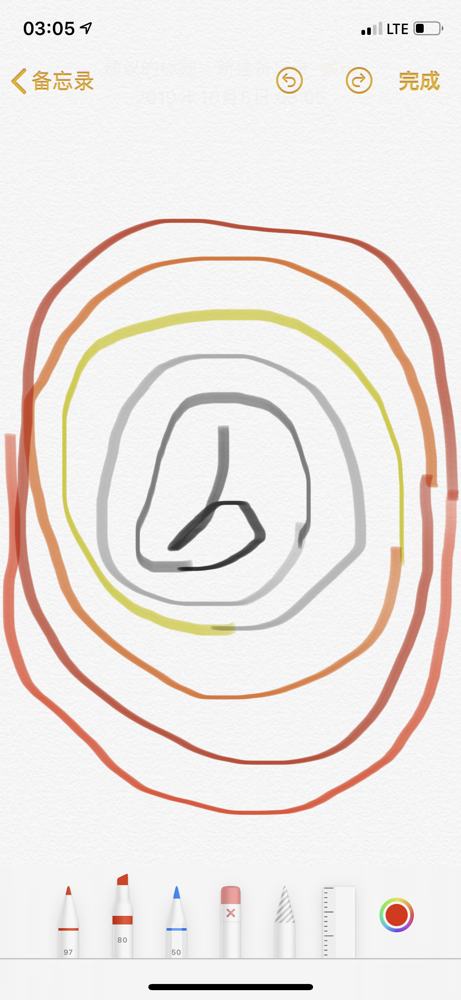

I asked: Can you please explain this for me?

He said: Well, in the middle is a chinese charater "人" (a person), not only represent myself but represent all of us. The balck represent death, that's common right? black just like the status of death, nothing, can hear anything or see anything. However, the black is being arounded with warmer and warmer color,so everything is not too bad, the balck will be turn to warm at the end. 

He kept a warm smile while saying this... I was being touched somehow ...

He is a friend of mine and I know he is a good person. But before this interview, I never found that he is such a kind, positive person. While doing this interview, he always consider about others feeling, don't want to screw up other's life because of his death...I believe I know him better after this interview observation and I do think this interview could be a tool to minimize the gap between people now.

After reading the above articles and researching more on your mid-term feedback, please post a minimum 750 word reflection on your process website. This honest personal reflection should include what your thoughts are on your research question now after the feedback and how do you approach it further.

Personal Reflection on Final Project
---

My more specific question of this project is “How to alleviate people’s fear towards death, make them know more about death and become someone who cherish life more but not afraid of death.” According to the feedback I have got from the critique session, I find out I need to take a step back and think more about the relationship between this project and myself.

When I did my research, I search thorough a great range of topics about my broader topic “death and people’s relationship and attitude about it”. I do get lot inspirations (and also depressions) in this process, but as being reminded by both professors, I realized I pay all my attention to a too broad range. What I am going to do now is to taking a step back and zooming inwards to myself and finding where I get the connection with this topic and why am I so interested about it.

Another point that I believe I need to dig in more about is to think about “what is death”. A lot of my ideas of prototype were about symbols of death, like “tombstone”, “obituary” and posthumous papers and so on. However, It’s really a difficult question. What is death? Is that a natural phenomenon? Is that an elimination of souls? Is that an action done by god? No one really knows. The only one answer I can take use of is the scientific one (although I don’t think that is the only “correct” answer). According to my research these days, I focus more on scientific aspects and how will it change our life like: what will happen as we take our last breath, and what happens next? How does thinking about this now help us in our daily life? I hope what I will produce of this project could be something that shows that by thinking deeply about death and rebirth we will come to appreciate the preciousness of every moment of our present life and how immensely meaningful it is for our happiness and freedom now and in all our future lives.

To understand what happens at the time of death and after death we first need to understand about the nature of the mind and how our mind is separate from our body. Death is the permanent separation of our body and mind. Although there is a relationship at present between our body and mind, this will definitely come to an end and our body and mind will separate forever.
I believe I can do something about this point: “ our mind is separate from our body”. Maybe an VR thing to show how our mind being separated from our body gradually, step and step, also to illustrate what will happen to the body in every steps.

Also, I am thinking of paying more attention to the feeling of death. At the time of death there is nothing in our ordinary life that can help us. Our friends and relatives cannot help us and even our doctor will give up hope. Our reputation, money, possessions and resources are meaningless when our life is slipping away. Only the imprints on our mind placed through our previous positive actions are of any use at the time of death and after death. What kind of feeling will that be? What can I do to make people feel that kind of feeling (or something similar) before the end point of their life? I believe this could be another point, which I can intersect in to discover my prototype.

The idea that receive praises is the one that “the interactive installation: to dissect a human brain”. I really like this idea and I think it would be quite practical and direct way to let people to face death. Dissecting is a quite professional and reliable way for people to experience death as the most of people accept a physical death could directly declare the ending of a person. Myself personally love the feeling of deconstruct things. I have been asked during the critique session that why I love dissection and what interested me about dissection? I never think of this question before, it just like a natural thing for me. I still don’t know if there are any other reasons for that. I will keep asking myself and trying to find out. This critique session really pushes me to another direction, which I think is a good thing: instead of considering people’s general thinking, consider more about myself and my personal idea more. That is the basics for doing further research.

## 7 in 7

Make seven discreet small-scale prototypes that address and build upon my research findings. Each day, a new prototype will be started and completed based on a particular question I have about my project. Each project must be conceptualized, produced and documented in a single day. I will  blog on the conceptualization, development and outcome of each of the seven projects, as well as my reflections on the experience of that day. 

#### Day 1

###### Question
Does dissecting brain and getting to know more about what will happen to brain before death help people alleviate the featr towards death?
###### Conceptualization
I think to dissect brain is a good idea to do in order to alleviate people's fear and let them know more about death. I want the whole process could be professional and reliable; to provide a totally neutral and rational knowledge to people with no religions/ emotional bias, so it fits everybody, because it's just the fact. I want to let people know that our body is just like a machine, and every machine has it's own problem and time, it's a process that death happens to everything, not only people, there is nothing to be afraid of.
###### Development
I find a video that about a conversation between a neurologist doctor and his student. The student's topic was about things related after death, but they also covered  things will happen to our brain 30s before people die. I find this part could be really useful to my project. Then I created a model of brain and colored every part of it and show the counterpart in color along with the audio to make my audio attached.(that I converted and edited from the video I mentioned before).
###### Outcome

[Here is the video I have made](https://www.youtube.com/watch?v=-pTgiC3lb9k&feature=youtu.be)

###### Reflection
I do think the process of making this prototype teached me a lot, from aspects like terminologies of brain, the specific process of death and so on.I can not say that I totally understand what is death now, but I am confident to say that I know much more about that than before, and with that knowledge, I feel a sense of ahcievement which brings me more confident to face death. I showed this video to my friends and they think its helpful to alleviate their fear as well.

#### Day 2

###### Question
Does everyone's death has same weight in people's mind? Do people think death is a kind of punishment/ or could it be a kind of freedom? 
###### Conceptualization
I want to make a little interaction sets/ could be called a game for people doing anonymous choice. My concept is to have different roles: a group of figures who got completely different experience and traits, and a death （represent death), an angel(represent live). I want to include an instruction for people to make them make their choice, if they want the figure die, they can put death on that figure, else versa.
###### Development
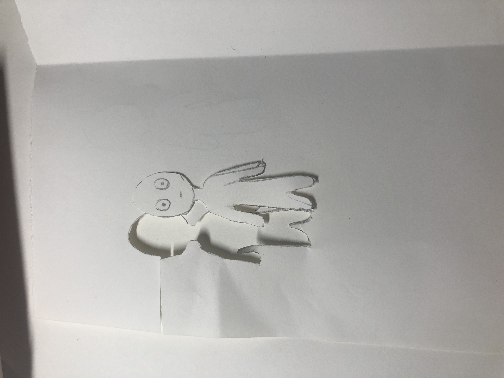
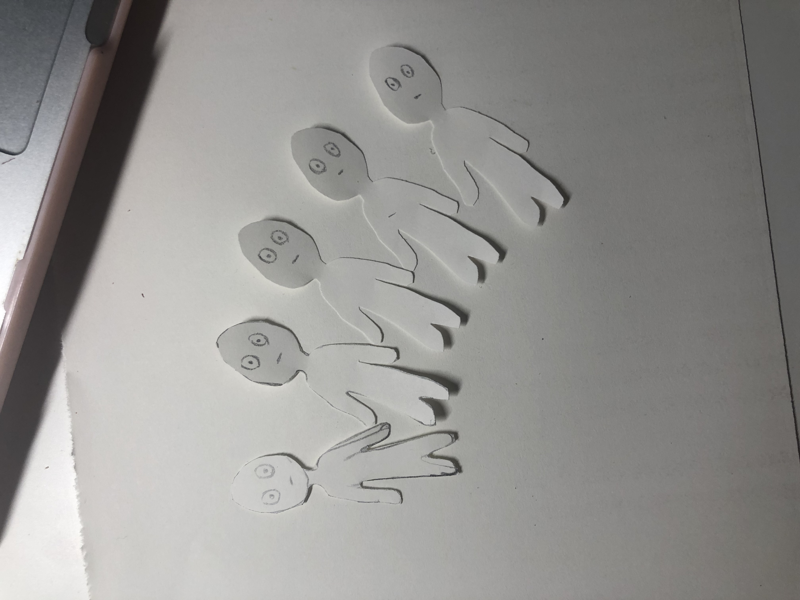
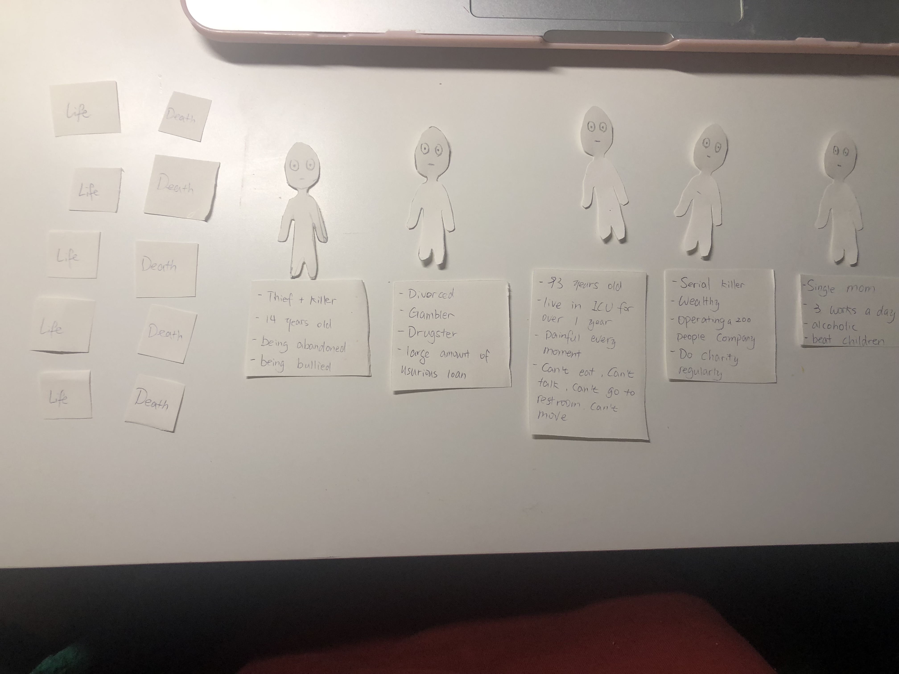
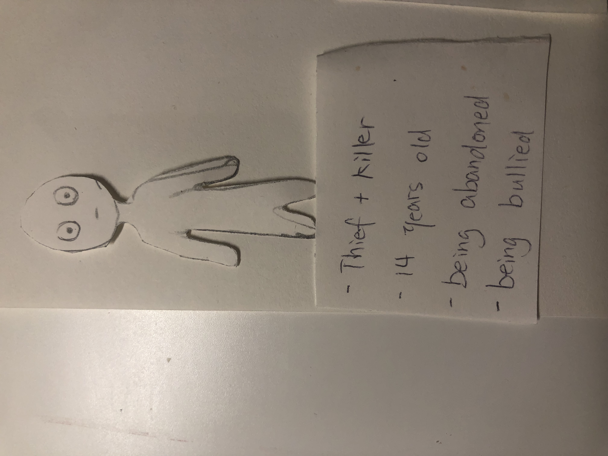
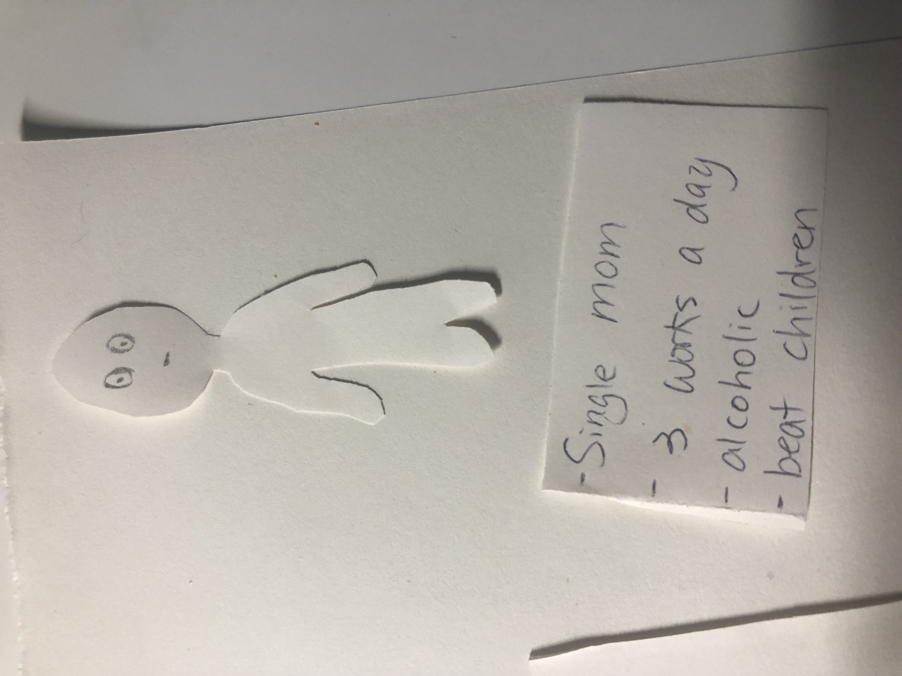
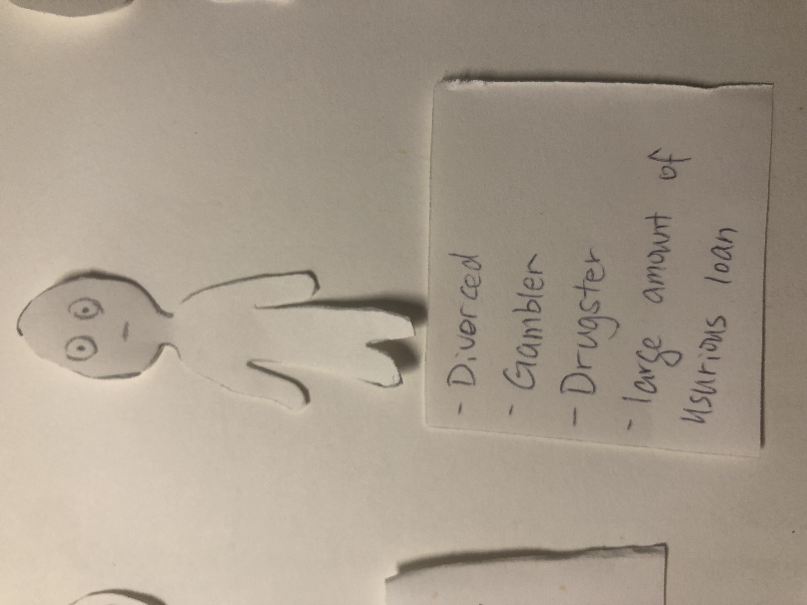
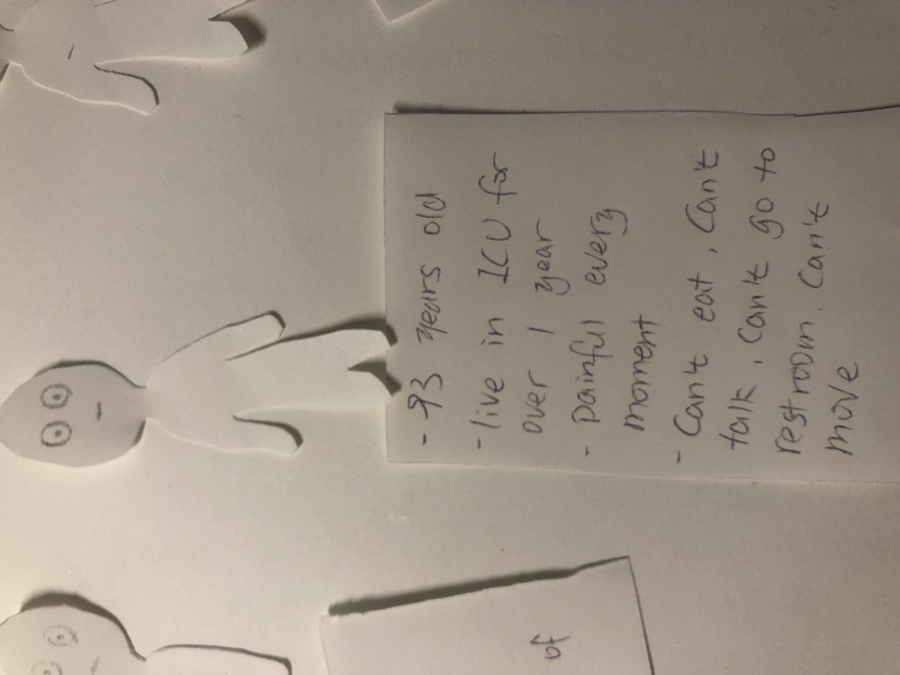
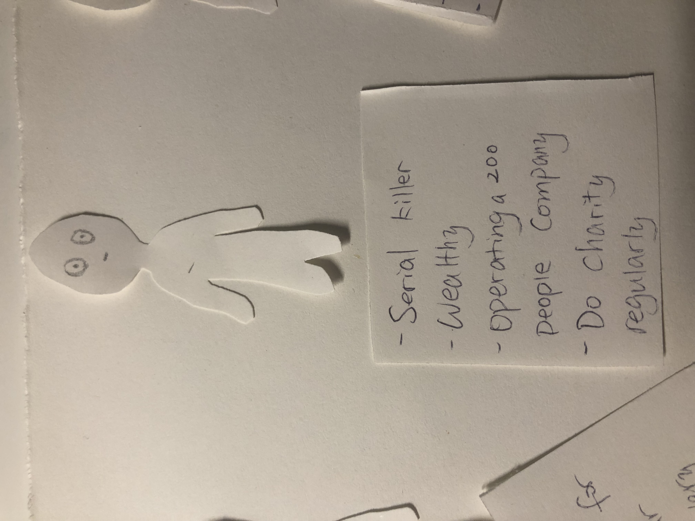

###### Outcome
Due to time limitation, I only got result from two people:
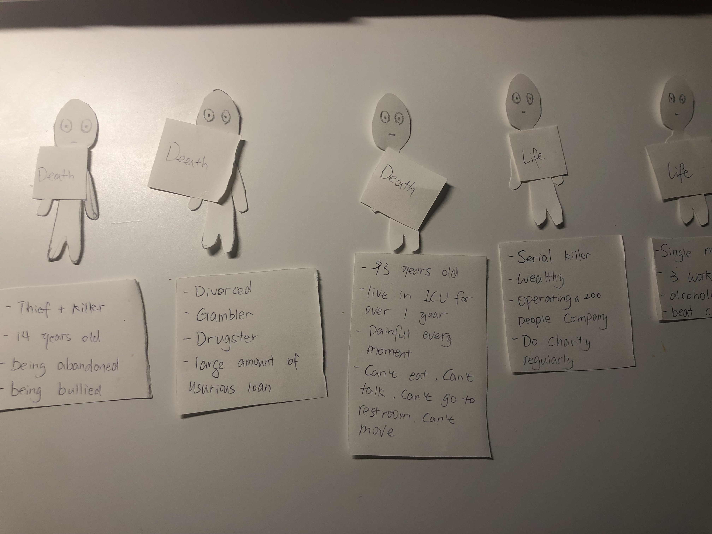
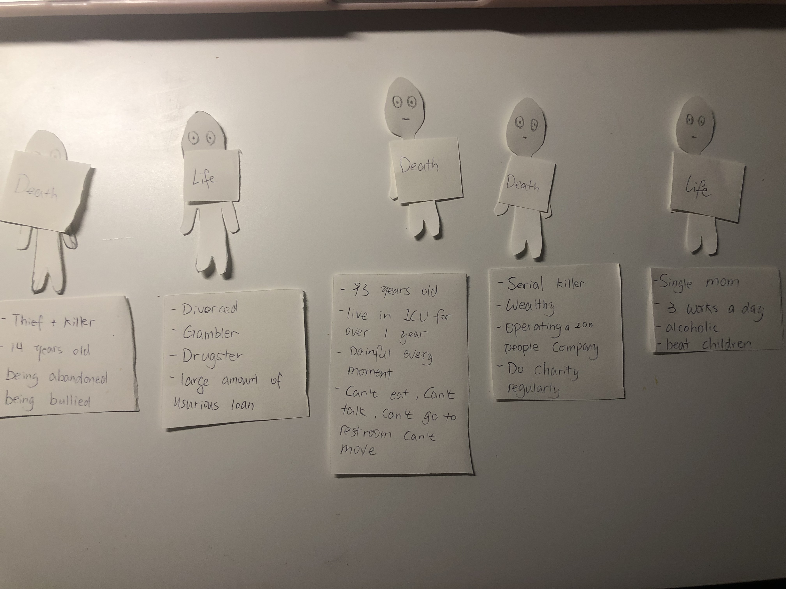

###### Reflection
I think it's something could reach to the deep point of people's heart. Both people had a hard time to make their decision. They make the decision as hard as these figures are really existed. I am willing to see that, because that reflects there must be someone who are similar to these figures in these two participant's life. They made almost completely different choice. When I ask about the reason, one of them said he make choice by considering how many benefit can this figure brings to the society and the other participant let everyone live except killers and the painful senior, she said life will be better as long as people still alive, whatever how poor they are right now. 

#### Day 3

###### Question
Does everything has it's own death?
###### Conceptualization
When I think more of death, I suddenly think about one question "does only living creatures have death?".To me, the answer is negative, I believe everything has it's own life to some extent, it might not like our death : "stop breathing" " heart stop beating" and so on, but there must be a way to show their death. What will be their own way to show it's death?
###### Development
What could be count to the death of an object? Does every part of a living creature has it's own death that not totally related to the living creature itself? What's the similarities of these objects and elements' death and living creature's death ( especially, people's death)?

I begin to have the idea of what's the similarity would be : People living having a lot of days, every day works well until one day, there is no more "another day". It could be the same for objects and elements: everytime it functions well, but there got to be one day, it's not working anymore. What impressed me is that it's a such tranquail process, it just simple, death is just a simple thing. 

I want to express what I have thinking into my prototype. I want to making a contrast with the functioning moments and the not functioning moment.I think little videos could be a good way to illustrate it.

###### Outcome

[For Eyes' death](https://youtu.be/RKzYABtu7Oc)

[For water tape's death](https://youtu.be/nolhJMJFkN4)

[For laptop's death](https://youtu.be/z44sVI_28AA)

###### Reflection
I do think everything has it's own life, and I believe it is a practicle way to show their life and death.

#### Day 4

###### Question
What is the feeling of death? 
###### Conceptualization
Today I have been thinking in another direction: what is the feeling of death? and futhermore, can I represent it and illustrate it by something else and to show people?

After a while of thinking, I come up an idea. If there is a thing like "soul", death would be a process that the soul gradually losing information sources. To illustrate that, here in the real world, the information source would be our organs which receive informations such as our skin, eyes, ears and so on. Along with the time passing, people's "information sources" will become more and more blurred and retarded, until compeletely stop functioning. 
###### Development
My idea is to making an instructional set. Let the participant stay alone in a small room (the soul), there is a wall with a lot of one side of string telephones (information sources). The other side of the string telephones connect to multiple people or other voice sources (like radios), keep sending information to the participant (a big range of information types, like somephone chatting with the particpants, radio plays music to the participant, someone reading newspaper and ask for the participant's opinions and so on.) The participants can only choose one cup a time so she/he would enjoying a period of really busy and fulfilling time. However, he/she will find out that all string telephones become blured and hard to hear, some of them stop asking his/her opinion...and there will be one string telephone stop working, immediately all of them stop working one by one.... Now, the only thing the participant can hear is silence, the only, everlasting core of the universe.
###### Outcome
Due to the time limitation, I was not able to make a wall full of string telephones, here is one of string telephone I have made. 

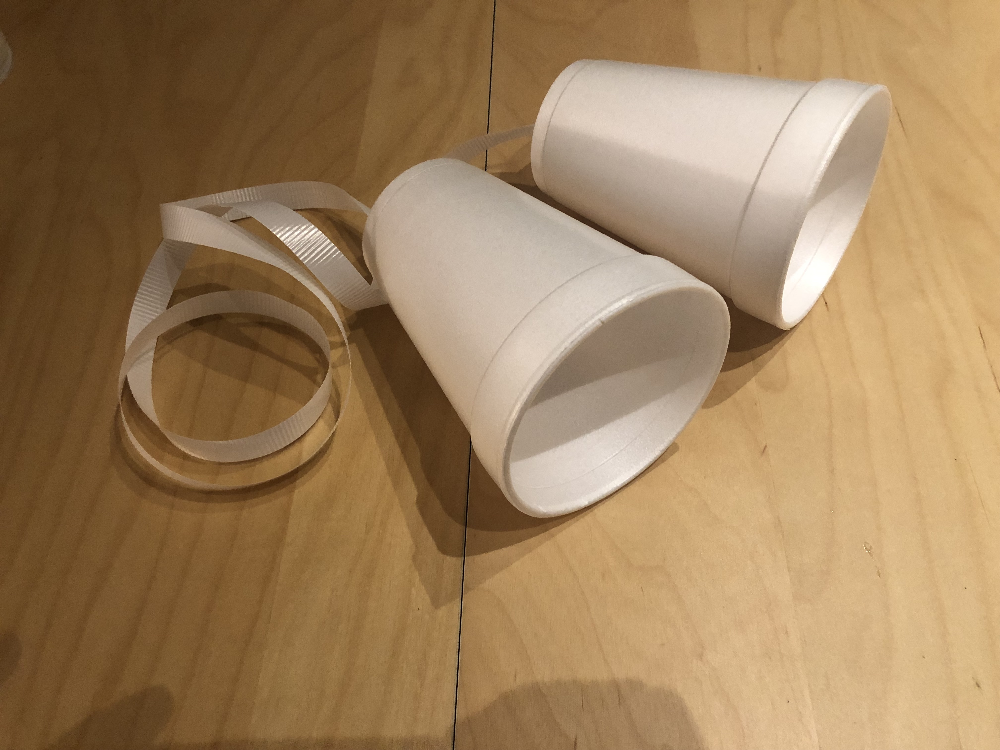

Here is a rough concept illustration of the instruction set:
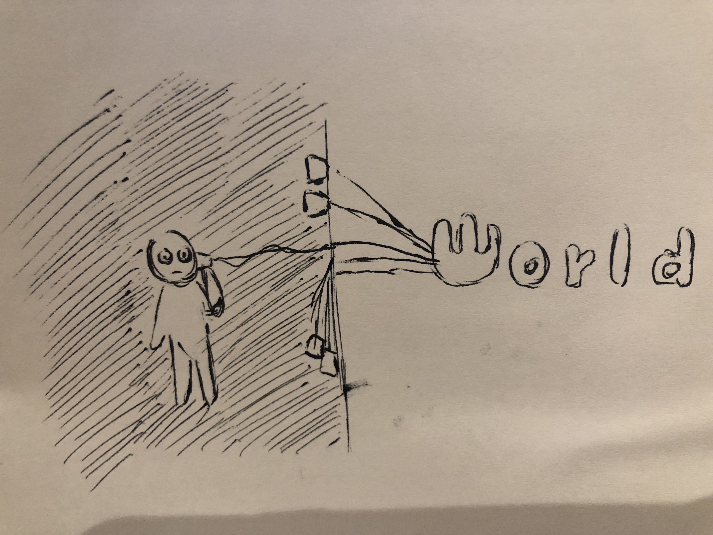

###### Reflection
When I done the whole ideation process,the question first come into my mind is what is the information source that I want to give up if I have to choose one. What comes with it is that what is the most difficult one for me to give up. Although I know we as people cannot control that, but I believe these two could be interesting question to think about.

#### Day 5

###### Question
What's the truth of death? What does "lost" feels like?
###### Conceptualization
Some of people think death as something that causes "lost of everything". From this points on, I want to immitate this feeling of losing for people, so they can get a better idea of losing and try to getting used to it. 
###### Development
To me, I think life is more of liking building an castle: we contributed our time and energy try to build a castle that as high as possible, some of us try to build it as high as possible, try to conquer other's height of castle; some of us just focus on the quality, try to build a castle that fits its own style. Death, is just like a nasty kid, who just get into your room and destroyed your castle when you have no idea where he came out. So I want to show this process.
###### Outcome

[Here is the video for "castle and nasty kid"](https://youtu.be/6QniUkz3xZM)

###### Reflection
I interviewed the participant of the video. I never told him what I exactly want to do before taking the video.I just told him that I need him to build a castle by using these cups. So there was a question for him that what does he feel when I put down all the cups, he said there was one moment that he feels really sad, and he wants to beat me.
I believe participant will feel deeper, more touchable feeling, if they spend more time and energy in building their castle. If I made the process harder, the outcome would be better.

#### Day 6

###### Question
What's the decomposition process of human body? What will body look like in different period of time? 
###### Conceptualization
I know that our body is composed by lots of different elements. When we die, the speed of each part of our body decomposing and re-naturing is different. Although we die in a certain moment, different part of our body die in different moments. What's the exact process? How long will they take to die? I want to explore more about it.
###### Development
I want to do an big installation set (immersive experiencing exhibition). Where people could chose to experience a certain part of their body's journey towards "death" or decomposition.
###### Outcome

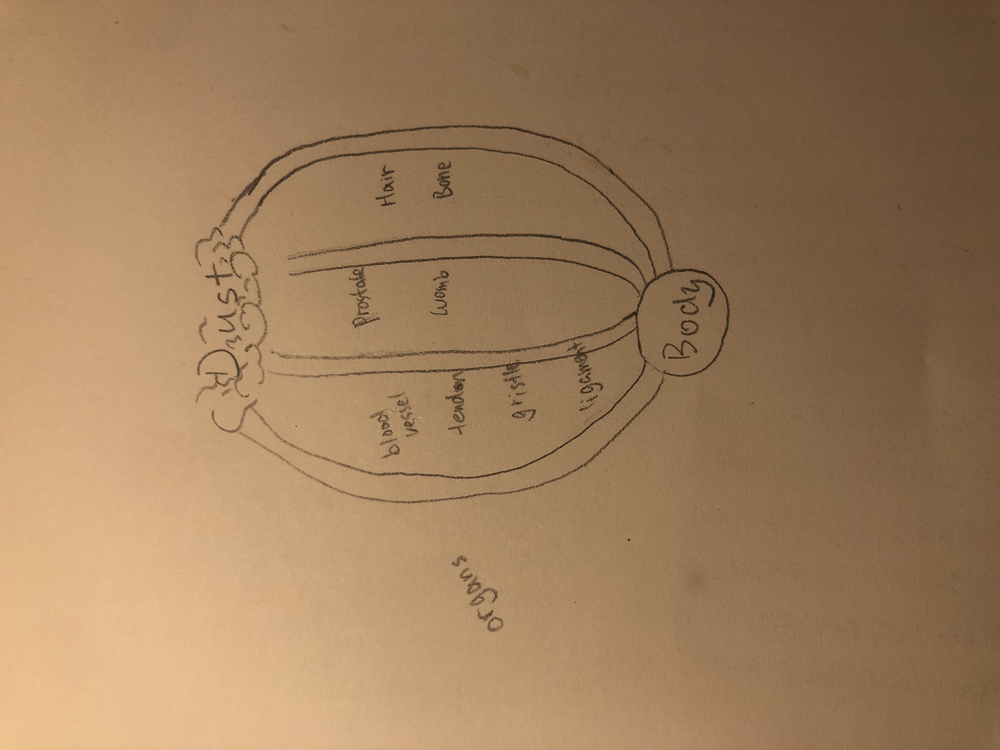

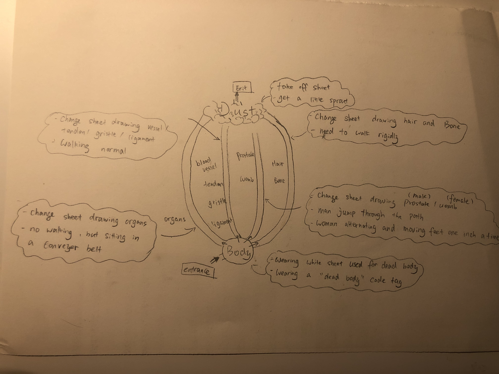

###### Reflection
I can almost imagine what will it looks like in the real world. It formed a completely self-consistent, closed re-nature circle, reflecting what really happens in the real world through decades into a little  immersive experiencing exhibition room in maybe, several minutes to be finished.I like what comes out, and I like the feeling of keep generating new thoughts related to this project and inserted them in to get a satisfying result.

#### Day 7

###### Question
How to alleviate people's anxiety about death? How to make people more cherish their life and not being afraid of death?
###### Conceptualization
I want to make something to remind people that anxiety and fear of death doesn't bring you any benefit, it only make your quality of life decreases. Also, I want to make something that could make people realize this more directly and in a simple, easy understable way. 
###### Development
I think for this one, I may want to try to make a little animation or a little game. The concept is to compare two different kinds of attitude towards death, and what these attitudes could change people's life. 
###### Outcome

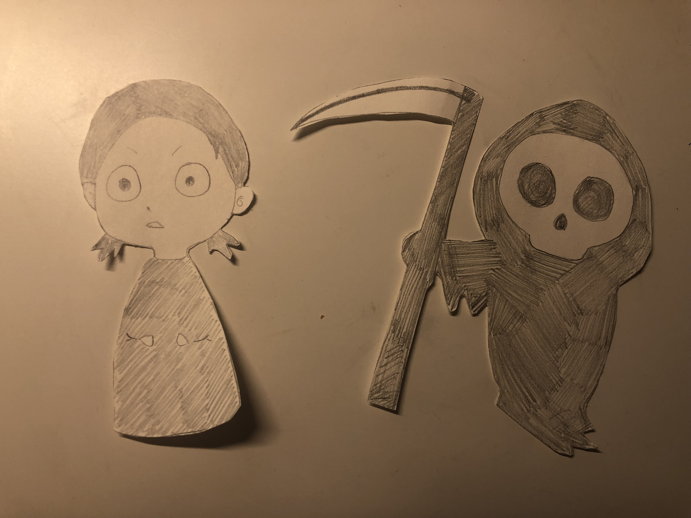

[Here is the video](https://youtu.be/YXycNaGB5x0)

###### Reflection
Whatever the attitude you give to death, it will always follow you in a certain distance (in the video, it's the distance between my fingers). In the future, if I get an chance to improve this project, I would set different scenes for this concept.Or I am thinking of taking some videos by using real people in real world. Through that video, I want to show people doing their daily life with a death right after them. Some people looks scared and always look back to the death, some people just doing whatever they need to do and don't even look at death. In order to show how people's different attitudes towards death.

## Moodboard

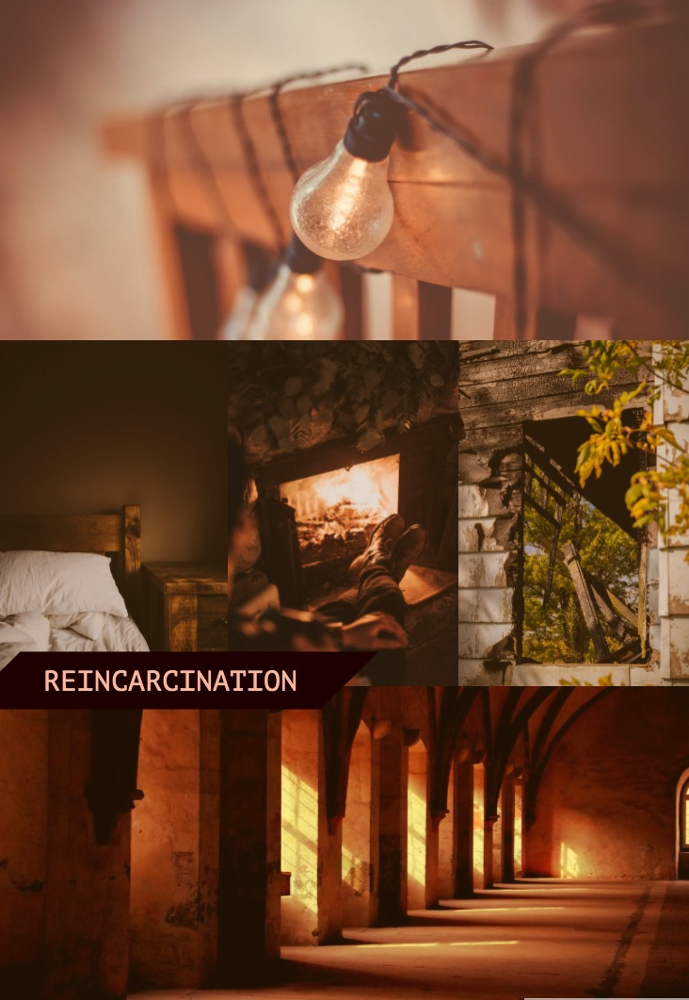

# Final Project prototypes & Ideation

## Final deliverble 

## Project Reflection

A. What are the specific questions you are attempting to answer in your prototypes?
 - How to alleviate people's pain of losing loved ones
B. What the three strengths of your project?
 - Natural feel
 - Lofty meaning but grounded effect
 - responsiveness
C. What are the three most critical issues for your project?
 - outter appearance
 - content of story
 - personal resonance
D. What can you do to address these issues, and to solidify the strengths?
 - make the process more private in order to get participants empathy easier as they feel more safe by exploring such an confidential topic.
E. What new questions do you have?
 - how to make participants realize all the inner meaning of this project without tell them directly?
F. What questions need to be answered in order to create a proof of concept prototype?
 - does the participants think about their own experience by using this installation?

