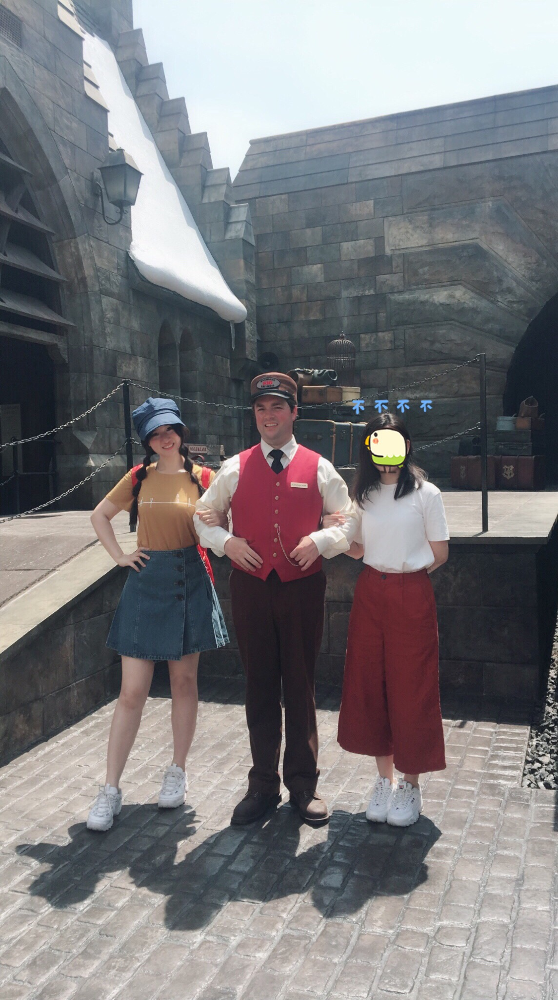
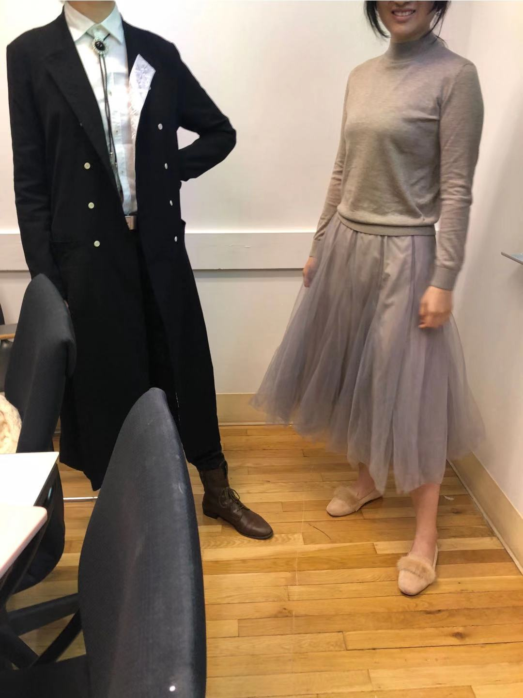

Ideation Phase:

# Pain point: 
According to my observation and persional experience, certain group of people (include me) really sensitive to how others view us. At this cirsumstance, confidence improvement becomes really important to us. 
In different occasions, especially some important ones (like dating, business meetings,etc), if I dress wrong or different with others, I will feel so uncomfortable and could never fit in to people anymore.
So I want to make a project to help people who are as low confident as me to dress correctly in order to improve confidence and social performance.

# Research question:
How can I help users choose proper outfit in order to reduce their social anxiety?

# Target audience:
People who are not confident of taking outfit and don't want to make mistake to lower their confidence.

# Goal:
Help user dress properly thus boost their social performance and confidence.

# Project overview:
"properfect"
An app helps you choose wardrobe based on occasions.

features include:
- you can customize your gender, height and weight and some other basic information to get more personalized recommendations
- go through your photo library to detect your sensitivity to temperature, making adjustment accordingly. Then you will not feel too hot/cold by wearing recommended outfits.
- in Calendar page, a avator wearing the outfit you chose will be recorded at that day. You can write down some experience that outfit brings to you and you can always go back and check.

----------------------------------------------
Goals and approach:

After having lots of ideas and thoughts going on, I realize I need to make sense of the mess. In order to rethink about what my goals are and what I want to accomplish, I used "3W" method by Abby Covert. By answering all these questions, I get a clearer mind.

## Start with why
-Why does this work need to be done?

 I want I could use this work to help people with social anxiety feel safe in new environment. An inproper outfit may cause a deep hurt in their self confidence, I don't want to see that. 
 
-Why is change needed? Why do those changes matter? Why should other people care?

 Nothing similar in the market yet, it's a gap between social anxieties and daily life which have to be filled with in order to make people feel self-satisfied and confident. It would be a wonderful thing if everyone in the world being confident, isn't it?
 
-Why hasn't this been tackled correctly?

-Why will this time be different?

----------------------------------------------
Research Phase:

# personal outfit journal (experience with different outfit everyday):

##  1

This outfit is one of my favourite. I choose this especially for our Tokyo Universal world trip. 

It was during summer vocation with a big sun, so I want to look energetic and cool.In orfer to show vitality, I chose a bright yellow as the main color of this outfit. For physical sunscreening, I was wearing a hat with a huge brim. The color of my hat is kind of matchy with my skirt.

I thought I have made a great choice and I had a wonderful experience at that day. 

##  2

This outfit was shot by my classmate. It was a game design class, I was get up late and just randomly picked something to wear.In the left side was another classmate of mine. The photo taker said to us "both of you not looking like come here to have class. You looks like gender avatar options provided in the beginning of a game!". 

It was an unique experience undeniably, but I was feeling like I was wearing wrong outfit for that occasion (at this time, college class). After this issue, I cannot stop myself doubting about my choice and cannot focus on the class. 
